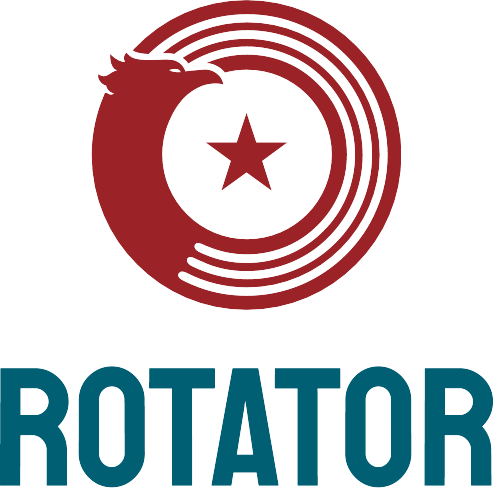

  # ROTATOR : A Coding Project
  The word ROTATOR speaks for itself. It rotates things.
  And also, it's a Palindrome, and that means it is the same,
  no matter which way you read it. Rotating it will get you the same word.
  And thats exactly what our app does. It checks if the word or phrase entered is a palindrome. Let's see...
 - https://rotatorapp.netlify.app -

 All logos were made possible by Jimdo.
 https://www.jimdo.com/

  
 

